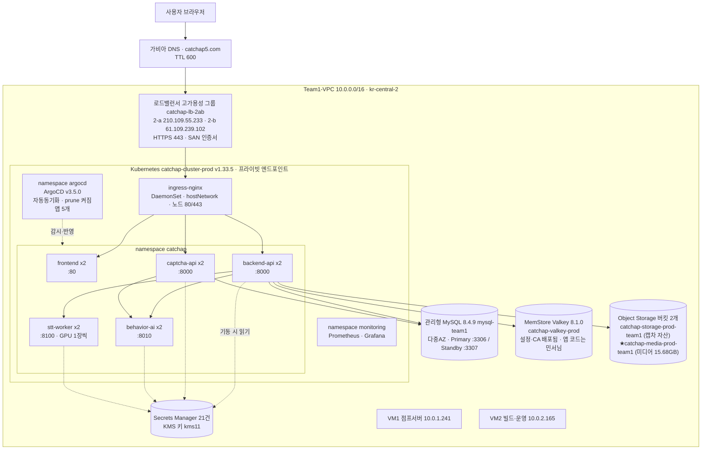
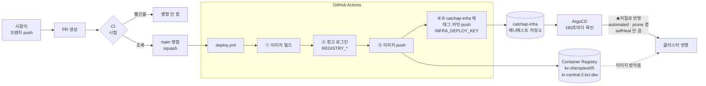
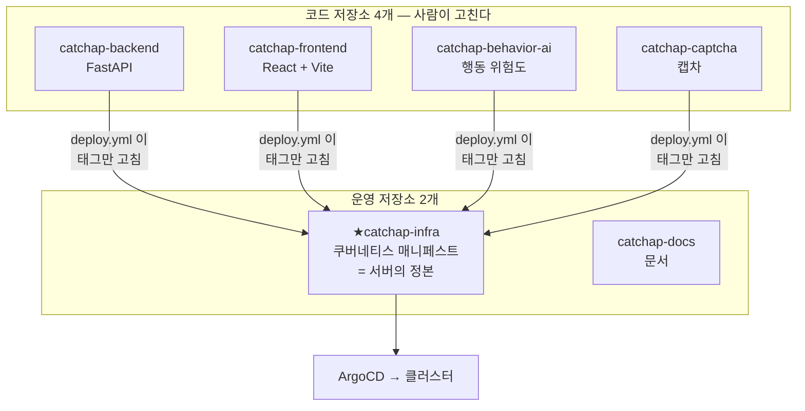

# CatChap 클라우드 아키텍처 — 그림 (★2026-08-12 저녁 기준)

★**이 문서는 「지금 실제로 이렇게 되어 있다」입니다.**
설계 의도·검토 과정·미해결 논의는 `00-아키텍처-설계.md` 에 있습니다.
★**그림으로 옮길 최종 정리본**은 `91-팀공유/18-아키텍처-최종본-디자인용.md` 입니다.

✅★★**2026-08-12 저녁 — 안 쓰는 자원을 정리하고 미디어를 전용 버킷으로 분리했습니다.**

```
서버      옛 VPC 5대 + 안 쓰던 새 VPC 3대 = ★8대 삭제 → 우리 서버 6대
서브넷    Team1-Subnet(옛 VPC) · catchap-gpu-2a 삭제 → ★우리 것 3개
퍼블릭IP  5개 반납 → ★우리가 쓰는 것 3개 · 미사용 0개
보안그룹  Team1-SG 삭제 → 우리 것 3개
버킷      ★미디어를 catchap-media-prod-team1 로 분리 (백엔드만 접근)
인증서    catchap5.com ★2026-10-20 08:36 만료 (수동 갱신)
```

✅★★★**2026-08-09 21:47 컷오버 완료.** 도메인이 **새 환경**을 가리킵니다.

```
catchap5.com          A      210.109.55.233                    (LB 2-a)
www.catchap5.com      CNAME  catchap-lb-2ab-…kakaocloud.com    ★두 IP 라운드로빈
api.catchap5.com      CNAME  같음
captcha.catchap5.com  CNAME  같음
```

✅★★**2026-08-10 — 앱 5개가 전부 클러스터 안에서 돕니다.**
마지막까지 밖에 있던 STT 워커를 **GPU 노드풀**로 들여왔습니다.
그 전에는 GPU VM 에서 사람이 `docker run` 으로 띄우고 있었습니다.

✅★★**2026-08-10 오후 — DB 마이그레이션도 자동이 됐습니다.**
ArgoCD PreSync 훅이 배포 **전에** `alembic upgrade head` 를 돌리고,
**성공해야** 새 파드를 띄웁니다. 실패하면 배포가 멈추고 옛 파드가 계속 섭니다.
→ `30-작업이력/79-0810-DB마이그레이션-자동화/README.md`

✅**앱 5개 모두 디스크(PVC)가 없습니다.** STT 모델은 이미지에 구웠습니다.

✅★★**2026-08-10 저녁 — GPU 노드도 2개 AZ 로.** STT 워커가 2벌이 되어
**무중단 배포 + AZ 이중화**를 갖췄습니다. → `30-작업이력/80-0810-GPU노드-2대-이중화/`

🔶★**옛 서버 5대는 정지했고(0811), 인터넷 노출도 끊었습니다(0812).**
퍼블릭 IP 5개 ★연결 해제 · `Team1-SG` 의 ★3306·8000·8100 삭제.
⚠️**다만 서버와 데이터는 아직 남아 있고** 옛 DB 비밀번호가 git 이력에 있습니다 —
**삭제(반납)가 진짜 끝입니다.**
→ `30-작업이력/0809-컷오버-실행.md` 7절

---

## 1. 한 장으로



★**읽는 법**

```
실선 -->    사용자 요청이 실제로 흐르는 길
점선 -.->   기동할 때 한 번 읽는 길 (비밀값) · 배포가 반영하는 길
```

★**노드 4대에 무엇이 앉아 있나 (2026-08-10 저녁 실측)**

```
host-10-0-2-128   m2a.xlarge     2-a   catchap-nodpol-prod
host-10-0-6-202   m2a.xlarge     2-b   catchap-nodpol-prod
host-10-0-2-210   gn1i.4xlarge   2-a   catchap-gpu-prod    ★nvidia.com/gpu: 1
host-10-0-6-115   gn1i.4xlarge   2-b   catchap-gpu-prod    ★nvidia.com/gpu: 1
```

★**GPU 노드도 2개 가용영역에 하나씩입니다** (0810 저녁). 그래서 앱 5개가 ★전부
2벌 이상이고 ★전부 무중단 배포이며 ★전부 2개 AZ 에 걸쳐 있습니다.
실측 — 배포를 걸고 밖에서 930번 두드려 ★실패 0건.

⚠️★**GPU 노드에도 보통 파드가 앉습니다.** 테인트를 일부러 안 걸었습니다 —
GPU 는 따로 세는 자원이라 GPU 를 요청하지 않은 파드는 GPU 를 못 쓰고,
오토스케일러가 없어 비워 둘 이득도 없기 때문입니다. 자세한 근거는
`30-작업이력/78-0810-STT워커-금고계정/README.md` 3절.

---

## 2. ★상태를 앱 밖으로 뺐다 — 이게 설계의 핵심

★**옛 구조의 문제는 「서버 하나에 다 들어 있었다」**는 것입니다.

```
옛 VPC                                  새 VPC
서버 안에 앱 + 파일 + 설정               앱은 ★아무것도 안 갖는다
   ↓                                       ↓
서버를 늘리면 로그인이 풀린다            ★몇 개로 늘려도 됨
서버가 죽으면 파일도 같이 죽는다          ★죽으면 다시 뜨면 됨
설정 바꾸려면 서버에 들어가야 한다        ★ConfigMap·Secrets Manager 를 고친다
```

★**앱이 안 갖게 된 것들이 어디로 갔나**

| 옛날에 앱이 갖고 있던 것 | 지금 어디에 | 왜 거기로 |
|---|---|---|
| 로그인 세션 | **JWT 토큰** | ★서버가 세션을 안 들고 있음 |
| 업로드한 영상·자료 | **Object Storage** | 파드마다 흩어지지 않음 · 15.45GB |
| 데이터 | **관리형 MySQL** | 자동 백업 · 다중 AZ · 자동 장애조치 |
| 비밀값(JWT·SMTP 등) | **Secrets Manager** | 이미지에 안 굽는다 · 한 곳에서 관리 |
| 일반 설정 | **ConfigMap** (`catchap-infra`) | git 에 남아 누가 언제 바꿨는지 보임 |

★**「무상태(stateless)」란 이걸 말합니다** — 파드를 **아무 때나 죽였다 살려도 되는** 상태.

---

## 3. ★배포가 어떻게 도는가 (0807 완성)



★**열쇠가 어디서 쓰이는지**

```
REGISTRY_USERNAME · REGISTRY_PASSWORD   ②③  ★카카오클라우드 창고 (GitHub 밖)
INFRA_DEPLOY_KEY                        ④⑤  ★catchap-infra (남의 저장소)
argocd-catchap-infra (읽기전용)          ArgoCD 가 읽을 때
★CI(검사)에는 열쇠가 ★하나도 안 들어갑니다 — 자기 저장소라 GitHub 이 임시증을 줍니다
```

★**태그가 커밋 해시입니다.**

```
image: …/catchap-backend:★85294c4
                          ↑ backend main 의 커밋 해시
→ ★"저 이미지 = 저 코드" 가 정확히 대응합니다
→ latest 였으면 무엇이 떠 있는지 알 수 없습니다 (0807 에 옛 매니페스트 501줄을 지운 이유)
```

✅★**자동동기화를 켰습니다 (0807 밤).** 병합하면 **사람이 SYNC 를 안 눌러도** 서버가 따라옵니다.
실제로 네 저장소 모두 한 바퀴가 끝까지 도는 것을 보고 켰습니다.

```
✅prune 도 ★켰습니다 (0808)
   전에 "켜면 손으로 만든 Secret 4개가 날아간다" 고 적어 뒀는데 ★틀렸습니다.
   버려도 되는 네임스페이스에서 확인 — prune 은 ★ArgoCD 가 자기 것으로 아는 자원만 지웁니다.
   손으로 만든 Secret 은 tracking-id 도 라벨도 없어 ★앱 자원 목록에 아예 없습니다.
   켤 때 지워진 것 ★0건 · Secret 4개 그대로.

⚠️★네임스페이스만 Prune=false — 지워지면 안의 파드·Secret 이 다 같이 사라집니다
⚠️selfHeal 은 계속 false — 급할 때 손으로 막는 길을 남겨 둡니다
★앱 정의 자체는 ArgoCD 가 관리 안 함 → 바꾸면 사람이 kubectl apply
```

★**되돌리기** — `catchap-infra` 에서 커밋 하나 revert 하면 옛 태그로 돌아옵니다.

### ★비밀값은 어디에 있나 (★2026-08-10 — 세 앱 전부 금고)

```
백엔드·캡차·행동AI   ★셋 다 금고(Secrets Manager)에서 기동할 때 직접 읽습니다
                    K8s 에는 ★금고 여는 열쇠 2줄씩만
                    ★kubectl exec 로 printenv 해도 값이 안 보입니다
                       — 로더가 파이썬 프로세스 메모리에만 넣기 때문

클러스터 비밀값      ★7개   backend 2 · captcha 2 · behavior-ai 2 · registry 1
                    (전에는 15개였습니다)
```

⚠️`catchap-registry` **1개만 남습니다.** 쿠버네티스가 파드를 띄우기 **전에** 필요한 값이라
앱이 읽어 올 수 없습니다. 구조상 못 옮깁니다.

★**값을 바꿀 때는 금고에서 새 버전을 만들고 `rollout restart` 만 하면 됩니다.**
코드도 git 도 안 고칩니다 — 로더가 `default_version` 을 따라갑니다.

★**시크릿을 묶는 기준은 「앱」이 아니라 「같이 회전하는가」입니다.**
캡차↔행동AI 공유 키, 백엔드↔캡차 공유 키는 **한 시크릿에 두 이름으로** 들어 있어
한쪽만 회전해서 조용히 깨지는 일이 생기지 않습니다.

<details>
<summary>(0808 에는 External Secrets 로 가려 했습니다 — ★관문이 닫혀 있었습니다)</summary>

카카오 금고는 API 모양·인증·엔드포인트가 AWS 와 달라 ESO 의 aws provider 를 못 씁니다.
**오퍼레이터를 설치하기 전에 두드려 확인**해서, 설치하고 걷어내는 일을 피했습니다.
→ `92-킵-대기/10` · `92-킵-대기/12`

</details>

---

## 3-2. ★★죽으면 어떻게 되나 — 이중화와 남은 약점

★**입구도 이중입니다.** 고가용성 그룹 `catchap-lb-2ab` 가 **두 영역의 LB 노드를 묶고** 있습니다.

```
catchap-lb-2ab (고가용성 그룹) · Active
  ├─ catchap-lb-2a  210.109.55.233  → catchap-tg-2a → 워커1 10.0.2.128:80
  └─ catchap-lb-2b  ★61.109.239.102 → catchap-tg-2b → 워커2 10.0.6.202:80

DNS 이름  catchap-lb-2ab-4957cfb14f.blb.kr-central-2.kakaocloud.com
          → ★두 IP 를 다 돌려줍니다
```

★**0807 직접 두드려 확인했습니다** — 두 입구 모두 살아 있습니다.

```
                       www.catchap5.com/   api.catchap5.com/api/v1/health
210.109.55.233 (2-a)        ★200                  ★200
61.109.239.102 (2-b)        ★200                  ★200
```

### 일곱 가지 상황

| 무엇이 죽나 | 결과 | 왜 |
|---|---|---|
| 파드 1개 | ✅**견딤** | 앱마다 2벌 · readiness 가 준비 안 된 파드를 빼 줌 |
| 워커1 (2-a) | ✅**견딤** | 그룹이 2-b 로 보냄 · 용량은 절반 |
| 워커2 (2-b) | ✅**견딤** | 마찬가지 |
| LB 노드 1개 | ✅**견딤** | DNS 가 두 IP 를 주고, 그룹이 산 쪽을 고름 |
| MySQL Primary | ✅**자동 장애조치** | ★0803 실제로 걸어 확인 — **3306 이 새 Primary 를 따라감 · 끊김 10초 남짓** |
| Valkey Primary | ✅**자동 전환** | 세션이 여기 있어 로그인 유지 (0804 인증·TLS 켜서 재생성) |
| GPU | ✅**자막 생성만 멈춤** | 쿠버네티스 밖 · 나머지 서비스는 정상 |

### ⚠️★남은 약점은 하나 — ★루트 도메인

```
www · api   CNAME → 고가용성 그룹  →  카카오가 ★산 쪽으로 보냅니다. 안전
★루트       A 레코드            →  ★DNS 는 건강검진을 안 합니다
```

★**루트에는 CNAME 을 못 붙입니다**(DNS 표준 · 가비아도 ALIAS 없음). IP 를 직접 적어야 하는데,
**그 IP 가 죽어 있어도 DNS 는 계속 알려 줍니다.**

★**리다이렉트로는 못 풉니다** — `catchap5.com → www` 308 은 **살아 있는 입구에 닿은 뒤에야**
일어납니다. 받은 A 레코드가 죽어 있으면 **308 을 받을 기회조차 없습니다.**

⬜**완전한 해결은 건강검진하는 DNS 로 이전**(예: Cloudflare · 루트 CNAME flattening).
★**컷오버가 끝난 뒤에** 봅니다 — NS 이전이라 MX·SPF·DKIM·DMARC 를 전부 옮겨야 하고,
하나라도 빠뜨리면 **메일이 죽습니다.**

### ★파드 배치 — 왜 「강제 분산」인가

```yaml
podAntiAffinity:
  ★requiredDuringScheduling…        # 「되도록」이 아니라 ★필수
    topologyKey: kubernetes.io/hostname
```

★**「되도록」으로 두면 두 벌이 같은 노드에 몰릴 수 있습니다.** 그 노드가 죽으면 **둘 다 죽습니다** —
이중화가 **이름뿐**이 됩니다. 그래서 **필수**로 걸었습니다.

★**대가는 「노드가 1대만 남으면 두 번째 파드가 Pending」** 입니다. **둘 다 죽는 것보다 낫다**고 보고
고른 쪽입니다. 입구가 이중이라 **노드 하나가 죽어도 서비스는 살아 있고**, 용량만 절반이 됩니다.

⚠️★**여기서 실제로 한 번 데었습니다 (0804)** — `maxUnavailable: 0` 이었을 때
**롤링 업데이트가 영원히 Pending** 이 됐습니다. 옛 파드가 두 노드를 다 쓰고 있는데
새 파드가 들어갈 자리가 없어서입니다. → **`maxUnavailable: 1`** 로 풀었습니다.

### 그 밖에 걸어 둔 것

```
PodDisruptionBudget  minAvailable: 1   앱 4개 전부
   → 노드 정비 같은 ★자발적 중단 때 ★한 벌은 반드시 남깁니다
topologySpreadConstraints  zone · ★ScheduleAnyway
   → 영역 균형은 ★"되도록" — 안 되면 그냥 뜹니다 (막으면 아예 못 뜨니까)
건강검진 경로   대상 그룹 둘 다 `/healthz` · 정상코드 `200-399`
   → ★308 을 정상으로 보는 것이 중요합니다 — 루트 → www 가 308 입니다
liveness · readiness 프로브   앱 4개 전부
HorizontalPodAutoscaler       ★없음 — 아직 필요 없습니다 (사용자 19명)
```

### ⚠️★ArgoCD 가 안 보는 파일이 둘 있습니다 (0807 발견)

```
k8s/50-ingress-공통.yaml   ★어느 앱도 안 봄
k8s/60-pdb-공통.yaml       ★어느 앱도 안 봄

ArgoCD 앱 4개가 보는 경로 = k8s/backend · k8s/frontend · k8s/behavior-ai · k8s/captcha
   → ★최상위 파일은 아무도 안 맞춥니다
```

★**뜻** — 누가 인그레스나 PDB 를 지우면 **ArgoCD 가 되살려 주지 않습니다.**
★**이것이 이중화에 직결됩니다** — PDB 가 사라지면 노드 정비 때 **두 벌이 동시에 빠질 수** 있습니다.

⬜**고치는 법** — `k8s` 최상위를 보는 앱을 하나 더 만듭니다. **자동동기화를 켤 때 같이** 정리합니다.

---

## 4. ★네트워크 — 무엇이 어디에 있나

```
Team1-VPC  10.0.0.0/16   (★3개 조가 공유하는 대역)

  catchap-jump-2a   10.0.1.0/24   2-a
        VM1 10.0.1.241 (+공인 210.109.82.148)   점프서버
        LB  catchap-lb-2a 10.0.1.254 (공인 210.109.55.233)

  catchap-core-2a   10.0.2.0/24   2-a
        워커1 10.0.2.128      ★catchap-tg-2a 대상 (catchap-nodpol-prod)
        워커3 10.0.2.210      ★GPU 노드풀 catchap-gpu-prod
        VM2   10.0.2.165      빌드·운영 (docker·kubectl·helm)
        MySQL Primary 10.0.2.193:3306
        Valkey Read   10.0.2.54:6379

  catchap-core-2b   10.0.6.0/24   2-b
        워커2 10.0.6.202      ★catchap-tg-2b 대상 (catchap-nodpol-prod)
        워커4 10.0.6.115      ★GPU 노드풀 catchap-gpu-prod
        LB  catchap-lb-2b 10.0.6.140 (공인 ★61.109.239.102)
        MySQL Standby 10.0.6.76:3307
        Valkey Primary 10.0.6.58:6379
```

⚠️★★**「퍼블릭 서브넷」 판정을 이름으로 하면 틀립니다 (0804 실측)**

```
이름을 봄        private_sn6   → "2-b 에 퍼블릭 서브넷이 없다"        ★틀림
★공식 정의를 봄   IGW 라우팅    → ★"6개 다 퍼블릭 서브넷"            ← ★판정 기준
콘솔에서 시험     골라짐         → ★확정
```

> 카카오클라우드 문서: **"인터넷 게이트웨이를 포함한 라우팅 테이블에 연결된 서브넷을
> 퍼블릭 서브넷이라고 합니다."**

★**이것 때문에 2-b 에 LB 노드를 놓을 수 있었고, 고가용성 그룹이 완성됐습니다.**
★**보안 함의** — 라우팅이 이미 열려 있으므로 **인스턴스에 공인 IP 를 붙이는 순간 인터넷에
노출**됩니다. 지금은 공인 IP 가 없어서 막혀 있을 뿐입니다. **「공인 IP 를 함부로 붙이지 않는다」**
가 규칙입니다.

⚠️★**알고 있어야 할 비대칭 하나**

```
★MySQL Primary 는 2-a · Valkey Primary 는 2-b — ★서로 반대입니다
   파드가 두 AZ 에 흩어지면 어느 쪽이든 한 번은 AZ 를 건넙니다
   같은 리전 안이라 지연은 작지만, ★알고 있어야 하는 비대칭입니다
```

★**인그레스가 호스트명으로 가르는 규칙 (실제 매니페스트)**

```
www.catchap5.com      /api  →  backend-api
                      /     →  frontend
catchap5.com          →  ★308 로 www 로 넘김 (경로·쿼리 보존)
api.catchap5.com      /     →  backend-api
★captcha.catchap5.com /     →  captcha-api      ✅DNS 붙음 (0810 확인)
```

---

## 5. ★GitHub 저장소 6개가 각각 무엇인가



★**`catchap-infra` 가 「서버가 지금 어떤 상태여야 하는가」의 정본**입니다.
서버에 직접 들어가서 고치면 **git 과 어긋나고, 다음 SYNC 때 되돌아갑니다.**

★**각 저장소의 검사(CI)가 무엇을 보는가**

| 저장소 | 무엇을 검사하나 | 시간 |
|---|---|---|
| `catchap-backend` | 파이썬 시험 (수백 개) · 병렬 실행 | 약 6~7분 |
| `catchap-frontend` | 타입 검사 + 빌드 | 약 40초 |
| `catchap-behavior-ai` | 파이썬 시험 232개 | 약 1분 10초 |
| `catchap-captcha` | 파이썬 시험 36개 | 약 27초 |
| `catchap-infra` | ★없음 — 진짜 검사는 ArgoCD 가 적용하면서 함 | — |

★**다섯 저장소 전부에 `main 직접 push 감시`** 가 붙어 있습니다.
우리 조직은 **Free 플랜 + 비공개**라 브랜치 보호가 **강제되지 않습니다**.
막을 수는 없으니 **즉시 드러나게** 했습니다.

---

## 6. ⬜아직 안 된 것 — 정직하게

```
✅ 컷오버              ★2026-08-09 21:47 완료 — 8개 경로 검증 · 무중단
                       → 30-작업이력/0809-컷오버-실행.md
✅ 옛 서버 내리기       ★2026-08-12 삭제 완료 — 서버 8대 · 보안그룹 1 · 퍼블릭IP 5
                       ①정지(0811) →②3306 차단(0812) →③★삭제(0812)
                       ★옛 VPC 흔적 0 (서브넷 Team1-Subnet 까지 삭제)
                       ⚠️비밀번호가 git 이력에 남아 있음 — 회전은 여전히 안 함(결정)
                       ✅옛 GPU 의 sw님 자산 2.05GB·소스 26개는 회수 후 삭제
                       → 30-작업이력/98-0812-안쓰는자원-정리/
⚠️ 메인 캡차           새 환경에 ★떠 있긴 합니다 (captcha.catchap5.com → 200)
                       다만 ★위젯이 라이브보다 뒤처집니다 (widget.js 다름 · participant 수집 끊김)
                       → feat/captcha-docker 가 그것을 고치는데 ★빌드가 실패합니다
                          (자산 367MB 가 git 에 없음 · ms님과 정할 건)
⬜ DB 3개              ★0807 밤 판입니다 (표 129개·행 348,050개·체크섬 12표 일치).
                       그 뒤로 옛 환경이 계속 서비스 중이라 ★컷오버 직전에 다시 옮깁니다
✅ ArgoCD 자동동기화     ★0808 에 켰습니다 — automated + prune:true · selfHeal:false
                       ⚠️selfHeal 은 ★일부러 끕니다 (손으로 급히 고친 것을 되돌리지 않도록)
                       근거 = 30-작업이력/0808-prune-켬-틀린-가정을-시험으로-깼다.md
⬜ ArgoCD 사각지대       ★인그레스·PDB 를 아무 앱도 안 봅니다 (3-2 절)
                       ★0808 에 인그레스 ★설정 두 줄은 git 으로 옮겼습니다
                         (catchap-infra k8s/ingress-nginx/ · ★손으로 적용해야 함)
                       컨트롤러 본체는 여전히 git 밖입니다
                       ⚠️0808 에 ★손으로 적용할 대상이 하나 늘었습니다 —
                         k8s/50-ingress-공통.yaml 에 www-captcha-api 를 더했습니다
                         (옛 환경의 www/captcha-api/* 라우트와 동등하게)
⬜ ★루트 도메인 이중화   DNS 가 건강검진을 안 합니다 (3-2 절) — 컷오버 뒤에 봅니다
⬜ SSL 인증서           ★2026-10-20 08:36 만료 · 갱신 수동 (실측으로 고침)
✅ VM3 · VM4            ★0812 삭제 (한 번도 안 쓴 서버였음)
🔶 알림(Alert Center)   ★0812 정책 4개(MySQL·Valkey·LB·VM CPU) · 수신자 팀 5명
                       ★메일 도달까지 실제로 확인함 (발신 성공 2 / 실패 0)
                       ⚠️VM CPU 는 ★에이전트 미설치라 데이터가 안 옵니다
                       → 30-작업이력/98-0812-안쓰는자원-정리/알림정책-0812.md
✅ captcha.catchap5.com  ★0809 컷오버 때 CNAME 으로 전환 완료
```

## ✅컷오버 전 조건 — ★전부 채우고 넘겼습니다 (0809)

```
1 ✅캡차 위젯을 라이브 판으로            라이브와 ★sha256 동일 (a3427d7a…)
2 ✅DB 3개 재이전 (컷오버 직전)          129표 중 ★126표 완전 일치
3 ✅미디어·자산 증분 동기화              3,473개 16,590,309,184바이트 ★증분 0
4 ✅대상 그룹 둘 다 Healthy               0804 이후 ONLINE 유지
5 ✅www/captcha-api 경로                 옛 환경과 동등하게 인그레스 추가
6 ✅루트 리다이렉트가 https 로            LB 에 XFProto+XFPort 켜서 수정
── ✅2026-08-09 21:47 가비아에서 레코드 4개 전환 ──
```

⚠️★**순서를 바꾸면 서비스가 끊깁니다.** 앱이 없는 곳으로 도메인을 돌리면 안 됩니다.
★그리고 **DB 재이전은 DNS 전환 「직전」**이어야 합니다 — 뒤에 하면 그 사이 글이 덮입니다.

---

## ⚠️★★이 문서를 고칠 때의 규칙 (0807 에 배운 것)

★**옛 결론과 새 결론이 같은 문서에 같이 있으면, 옛것을 집게 됩니다.**

0807 에 이 그림을 처음 그리면서 **넷을 틀렸습니다.**

```
① "LB 가 워커1만 본다"          → ★0804 에 고가용성 그룹으로 해결됨
② "2-b 에 퍼블릭 서브넷이 없다"  → ★0804 에 6개 다 퍼블릭으로 확인됨
③ "MySQL failover 미검증"      → ★0803 에 실제로 걸어 확인됨
④ "Valkey 비밀번호 없음"        → ★0804 에 인증·TLS 켜서 재생성됨
```

★**전부 `00-아키텍처-설계.md` 의 ★앞부분(0731)을 읽고 쓴 것**입니다.
같은 문서 **뒷부분에 정정이 있는데**, 앞 절에 **정정 표시가 없어서** 그대로 믿었습니다.

★★**규칙 — 「미해결」이라고 적힌 것을 옮겨 적기 전에, ★그 뒤에 정정이 있는지 찾는다.**
그리고 **정정했으면 옛 절에 「★해결됨 — N절 참조」를 반드시 붙인다.**

★**가장 확실한 것은 실물을 두드려 보는 것입니다** — 이번에도 `nslookup` 과 `curl` 로
**두 입구가 다 200 인 것**을 보고서야 확정했습니다.

---

관련: `00-아키텍처-설계.md` (설계 의도·검토 과정) · `00-아침에-하실일.md` (지금 할 일)
· `91-팀공유/10-CICD-처음부터-끝까지-공부용.md` (개념 설명)
